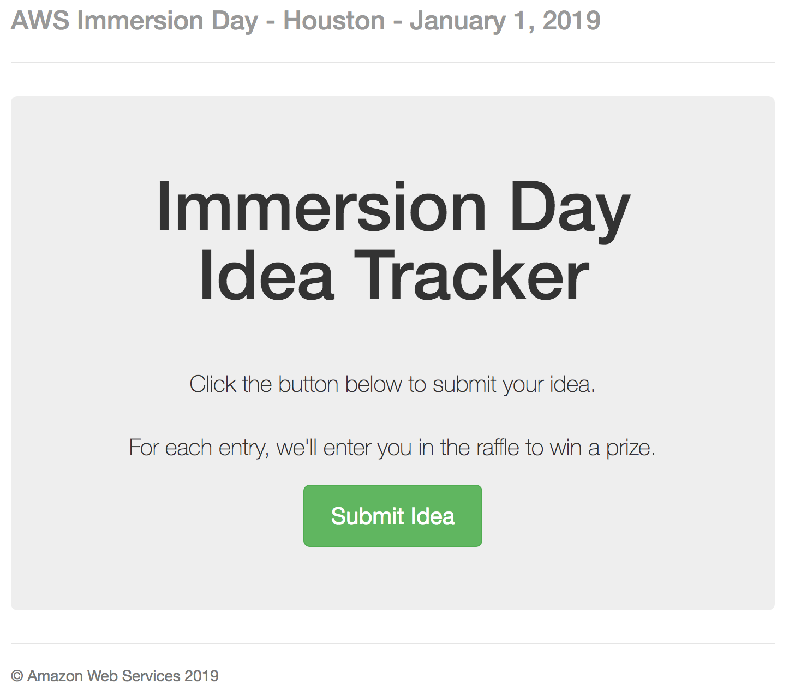
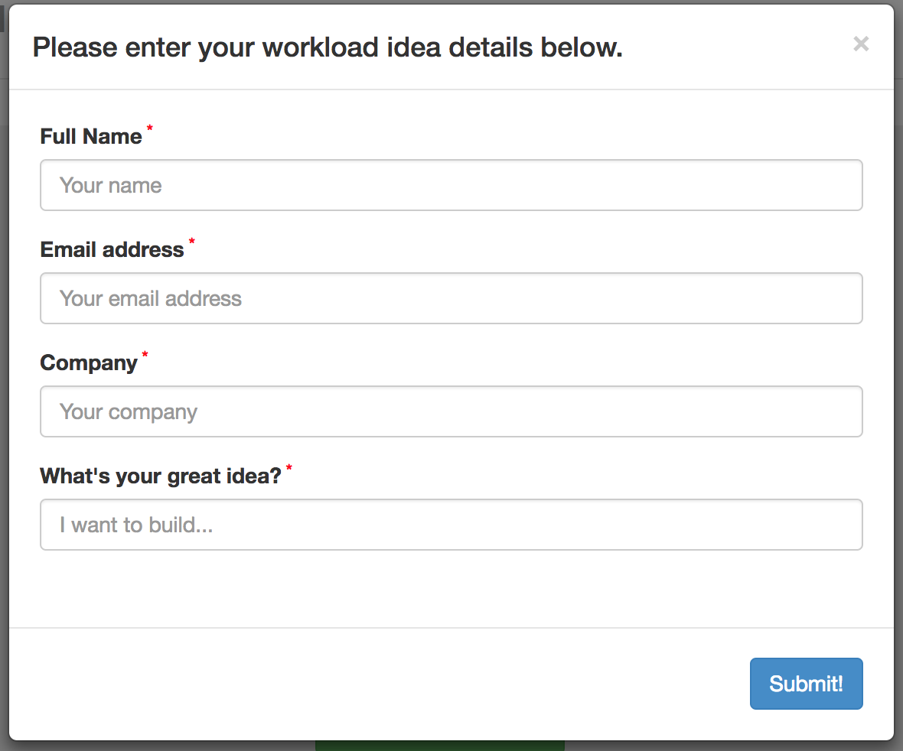

# Multi-customer Immersion Day Idea Tracker
When holding multi-customer events, it can be difficult to present at the same time as tracking customer ideas for new workloads or for follow-up for deep dive conversations.  This tool is designed to allow a "self-service" method for customers at AWS events to enter their own ideas throughout the event.  Customers can enter as many ideas as they would like.  One concept to encourage more idea capture is to hold a raffle for a prize at the end of the day, randomly chosen from the list of ideas entered.  

The architecture for this application is very simple.  Elastic Beanstalk is used to stand up a t2.micro EC2 instance behind a load balancer and a DynamoDB for backend storage.  The t2.micro hosts a Node.js Express website form app which records entries to the database.  When the form is submitted, a SNS message is published to the EB environment SNS topic.  The SNS topic is automatically subscribed to the email in the configuration notification as well as published to SQS for further message processing if desired.  Data can be retrieved from the database via the standalone Python application, which also selects an entry at random as the winner.

The Elastic Beanstalk environment is easy to deploy, and is intended to be used for single-serving events.  You can customize the deployment a day or two before the event, and then tear it down afterwards.  
**Note:** As configured here, terminating the Elastic Beanstalk environment will delete your DynamoDB table as well.  Make sure you have exported all data from DynamoDB before terminating the environment.

## Customization instructions and Prerequisite setup
Clone this repository to your laptop.

You will want to modify the source code for your event and your AWS environment.
  1. Modify '.ebextensions/options.config' file:
     * Row 3: Update your email to be notified via SNS when new items are added to the table.
     * Row 6: Update the SESSION value to identify the event name & date.  The SESSION variable is used in the website title as well as a field recorded in DynamoDB.
  2. To further modify event information (for example if the event is not an Immersion Day), modify the '/views/index.ejs' file:
     * Rows 9, 29, and 46 reference "Immersion Day"
  3. Form data capture and puts into DynamoDB are configured in 'app.js' file.

While not required for deploying the application, to use the Python scripts to write the DynamoDB table to CSV and pick a raffle winner, you will additionally need to configure Systems Manager Parameter Store with your database IAM user credentials and update the DynamoDB table name in the Python script.  
**Best Practice: Never store your credentials in the code!**
  1. Recommended: create a new programmatic-access-only IAM user with DynamoDB read-only AWS-managed policy.
  2. Create a SSM Secure String type Parameter with the key `DynamoDB_Reader_User_Creds`.
  3. The value of the SSM Parameter should be in the format
     * `{"Access key ID": "<your access key>", "Secret access key": "<your secret key>"}`
     * Note the use of double-quotes in the JSON value.
  4. The DynamoDB table name is hard-coded in the Python script.  Edit line 8 of the file 'scan_ddb_to_csv_pick_winner.py' after the table is created by Elastic Beanstalk.

## Deploy the application via EB CLI (Recommended)
You can deploy the application using the following steps:
  1. [Install the AWS Elastic Beanstalk Command Line Interface (CLI)](http://docs.aws.amazon.com/elasticbeanstalk/latest/dg/eb-cli3-install.html).
  2. Create an IAM Instance Profile named **aws-elasticbeanstalk-ec2-role** with the policy in [aws-elasticbeanstalk-ec2-role-policy.md](aws-elasticbeanstalk-ec2-role-policy.md). For more information on how to create an IAM Instance Profile, see [Create an IAM Instance Profile for Your Amazon EC2 Instances](https://docs.aws.amazon.com/codedeploy/latest/userguide/how-to-create-iam-instance-profile.html).
  3. Run `eb init -r <region> -p "Node.js"` to initialize the folder for use with the CLI. Replace `<region>` with a region identifier such as `us-west-2` (see [Regions and Endpoints](https://docs.amazonaws.cn/en_us/general/latest/gr/rande.html#elasticbeanstalk_region) for a full list of region identifiers).
  4. Run `eb create --instance_profile aws-elasticbeanstalk-ec2-role` to begin the creation of your environment.
     * Enter the environment name of your choice.
     * Enter the CNAME prefix you want to use for this environment.
     * Note: The CLI will likely time out after 10 minutes due to the CloudFront distribution time to deploy, as well as the EB status will go severe for a few minutes before returning to ready.  To check on the deployment, you can run `eb events -f`.
  5. After modifications to the source code, commit changes to git local repo (necessary to commit, not necessary to push), then run `eb deploy` to update the EB environment with the committed changes in your local git repo.
  6. Find the CloudFormation Stack that Elastic Beanstalk sets up during deployment.  The 'Outputs' section will provide the CloudFront DNS name so your end-users will connect to the tool via HTTPS.  (Recommendation is to use a link shortening service like [Bit.ly](http://bit.ly) to create a more friendly URL for your end-users.)

## Deleting the EB environment via CLI
  1. Run `eb terminate --all` to clean up.  
  **Note: the DynamoDB table will be deleted by this command.**  Please ensure data is exported from DynamoDB before terminating the environment.

## Deploy the application via console
You can deploy the application using the following steps:
  1. Lorem Ipsum
  2. Lorem Ipsum

### This tool was based on the [AWS Elastic Beanstalk Express Sample App](https://github.com/aws-samples/eb-node-express-sample)
